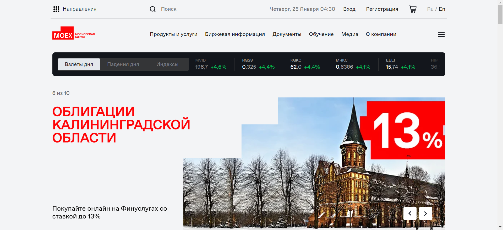
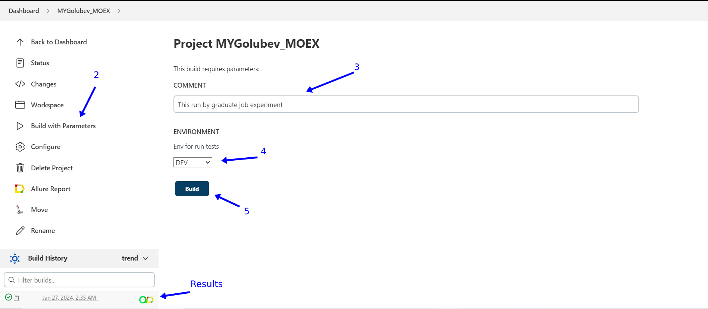
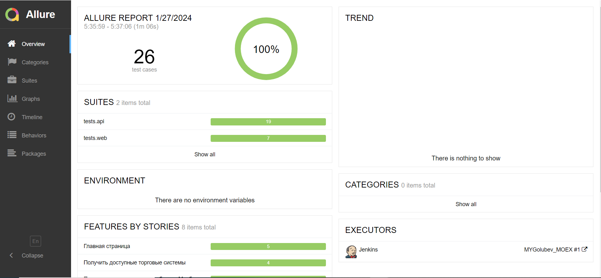
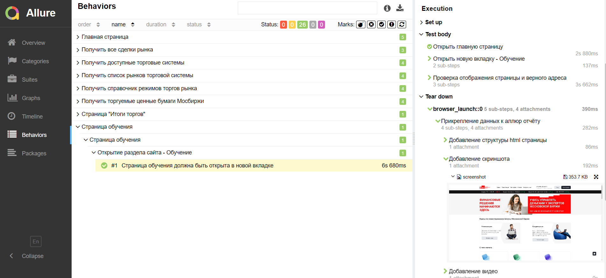
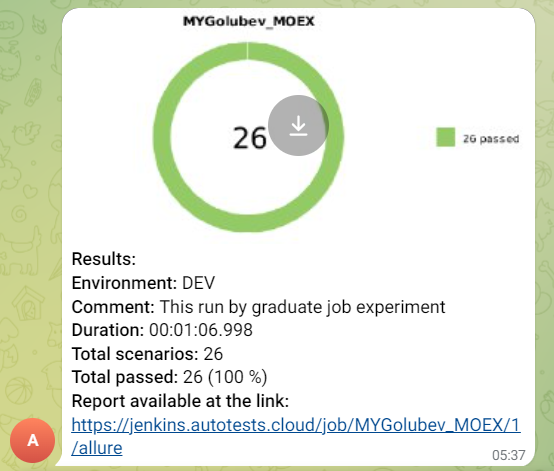
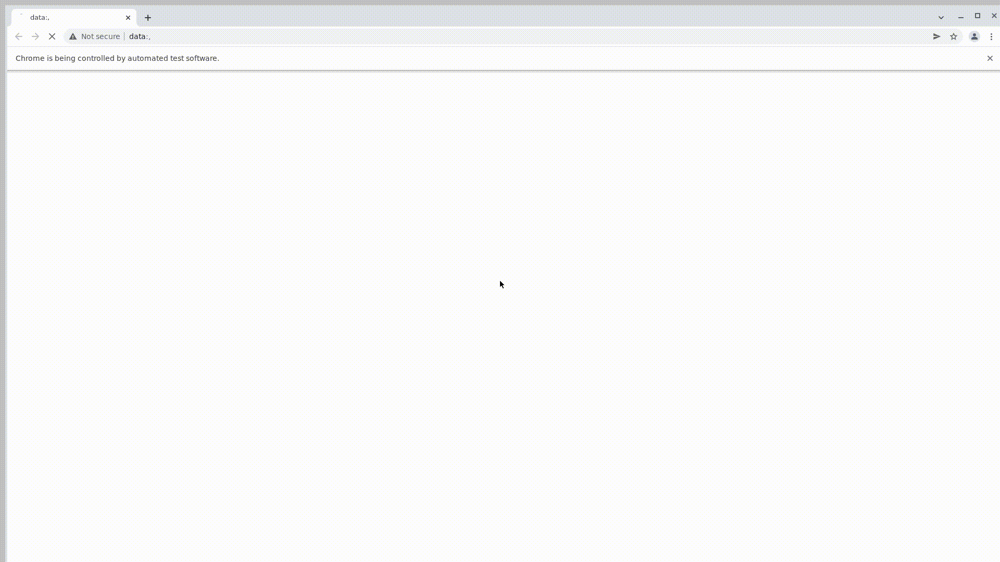

## UI and API Testing Project using the Moscow Exchange

> <a target="_blank" href="https://www.moex.com/">AutomationExercise</a>

### Project features

- Project build in Jenkins
- Execution of UI tests on a remote browser in Selenoid
- Reports with video, screenshot, logs for better debugging
- Comprehensive logging of requests and responses in API tests for better debugging
- Allure reports
- Integration with Allure TestOps
- Test run notifications in Telegram

### List of tests implemented in the project

#### UI

- [x] Base operation of the site
- [x] Switch language to english
- [x] Information search
- [x] Time on site in Moscow timezone 
- [x] Pop-up menu
- [x] Open learning resources
- [x] Open page with bidding results

#### API

- [x] Get available trade system in different formats
- [x] Get available securities in different formats
- [x] Get directory of market trading modes
- [x] Save information of market list by engine item in json file
- [x] Get all trades of market by limit

### The project is implemented using the following tools:

  <code></code>
  <code></code>
  <code></code>
  <code></code>
  <code></code>
  <code></code>
  <code></code>
  <code></code>
  <code></code>
  <code></code>
  <code></code>

### Automated tests are executed on the Jenkins server
> <a target="_blank" href="https://jenkins.autotests.cloud/job/008_Legiomax_graduate_work_exp/">Link to the project in Jenkins</a>

### Build parameters

* `ENVIRONMENT` - defines the environment for testing, defaults to DEV
* `COMMENT` - comment to the build

### To execute automated tests in Jenkins:

1. Open the <a target="_blank" href="https://jenkins.autotests.cloud/job/008_Legiomax_graduate_work_exp/">project</a>
2. Select the `Build with Parameters` option
3. Enter a comment in the COMMENT field
4. Choose the environment from the ENVIRONMENT dropdown list
6. Press the `Build` button

### Viewing results in Allure Report

Viewing overall test launch results

Viewing test cases with execution report

### Integration with Telegram

Sending test run reports to Telegram

### Video report of test execution demonstrating a product purchase

